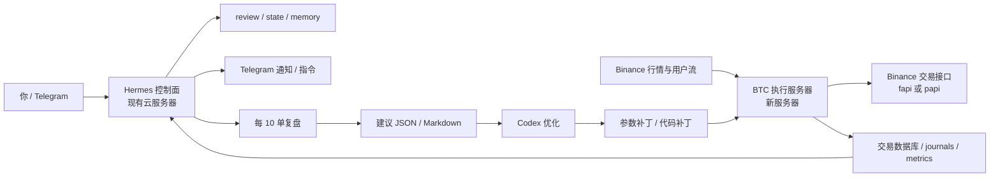

# BTC 新服务器部署蓝图

更新日期：2026-04-20

## 1. 目标

新服务器只负责：

- `BTCUSDT` 执行
- 数据采集
- 信号与方向判断
- 下单与风控
- 交易数据库 / journals / review packet 生成

现有服务器只负责：

- Hermes gateway
- Telegram
- Phoenix 状态页
- 每 10 单复盘
- review 建议归档
- 唤醒 Codex 做优化

## 2. 拓扑



## 3. 推荐规格

- 地区：东京或新加坡
- 系统：Ubuntu 22.04 或 24.04
- CPU：4 vCPU 起
- 内存：8 GB 起
- 磁盘：50 GB NVMe 起
- 网络：固定公网 IP

## 4. 部署步骤

### Phase 1: 基础设施

1. 新服务器安装 Python 3.11+
2. 新建独立目录 `/opt/phoenix-btc`
3. 创建独立虚拟环境
4. 配置系统代理（如果需要）
5. 记录服务器公网出口 IP，用于 Binance API 白名单

### Phase 2: 主账户 API

1. 新建一把主账户专用 API Key
2. 只给新服务器使用
3. 绑定新服务器出口 IP
4. 不开启提现权限
5. 明确账户模式：
   - 经典 USDⓈ-M -> `fapi`
   - Portfolio Margin -> `papi`

### Phase 3: 执行引擎

1. 部署 `btc_engine`
2. 部署 `btc_config`
3. 配置 systemd 服务
4. 启动数据采集、状态存储、review 生成
5. 先跑 shadow / dry-run

### Phase 4: 与 Hermes 对接

1. 定时把 review packet 推送到现有服务器 `/root/.hermes/memories/btc_reviews/`
2. 生成：
   - `latest.json`
   - `review_0010.json`
   - `review_0010.md`
3. Hermes 每 10 单发 review 摘要到 TG
4. Codex 读取 review 并给出优化补丁

## 5. 运行原则

- 新服务器不跑 Hermes gateway
- 现有服务器不直接执行 BTC 高频交易
- Hermes 只读 review / state，不直接改 live 策略
- 参数变更必须可回滚

## 6. 服务建议

建议后续新增 systemd 服务：

- `phoenix-btc-engine.service`
- `phoenix-btc-backfill.service`
- `phoenix-btc-review.service`

## 7. 对接目录

新服务器建议目录：

```text
/opt/phoenix-btc/
  .venv/
  config/
  data/
  logs/
  btc_engine/
  scripts/
```

本仓库里对应骨架：

- [btc_engine/README.md](/Users/yanshisan/Desktop/币安交易/btc_engine/README.md)
- [btc_config/live.env.example](/Users/yanshisan/Desktop/币安交易/btc_config/live.env.example)
- [btc_config/strategy.yaml.example](/Users/yanshisan/Desktop/币安交易/btc_config/strategy.yaml.example)
- [btc_config/risk.yaml.example](/Users/yanshisan/Desktop/币安交易/btc_config/risk.yaml.example)
- [btc_data/README.md](/Users/yanshisan/Desktop/币安交易/btc_data/README.md)

